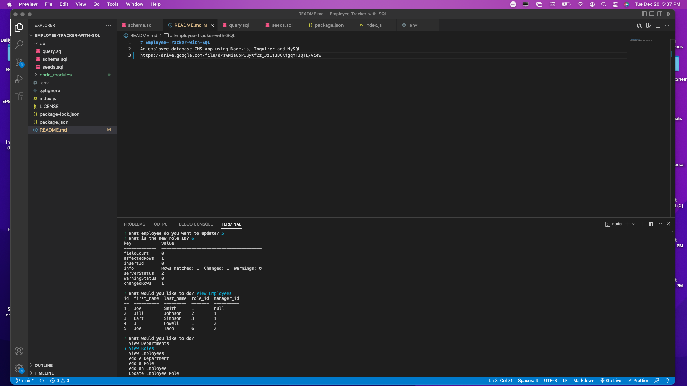

  # Title
Employee Tracker with SQL

## Description
An employee database CMS app using Node.js, Inquirer and MySql

## Table of Contents
* [Installation](#installation)
* [Usage](#usage)
* [Contributing](#contributing)
* [Tests](#tests)
* [License](#license)
* [Questions](#questions)
* [Screenshot](#screenshot)

## License
  
License Info: https://opensource.org/licenses/alphabetical 

## Installation
npm install

## Usage
From CLI, run node index.js and follow prompts.

## Contributing
Refer to license requirements, and go to town with it.

## Tests
There is no built-in test functionality such as jest for this project, as it wasn't required. Just try it!

## Questions 
### GitHub Profile link
https://github.com/https://github.com/J-Howell-kc  
### Email
Feel free to direct any questions to howell_j@hotmail.com. Thanks.

## Screenshot
;